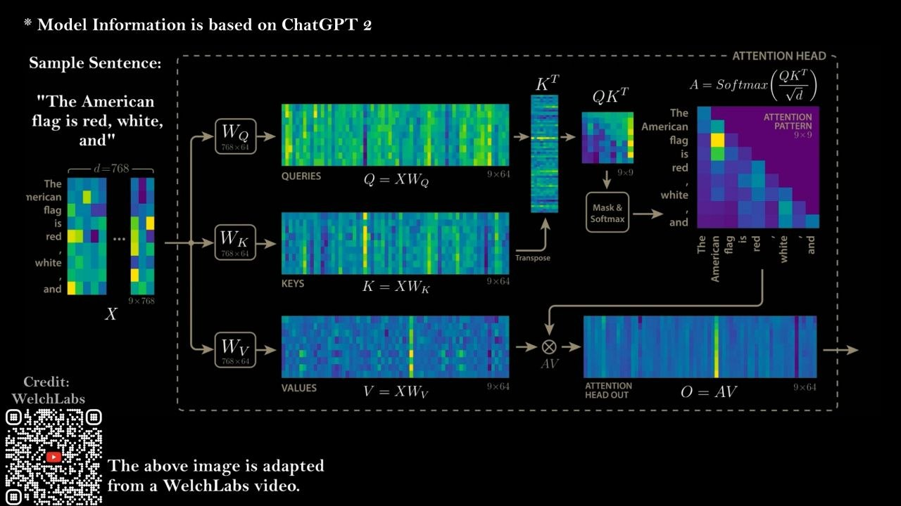
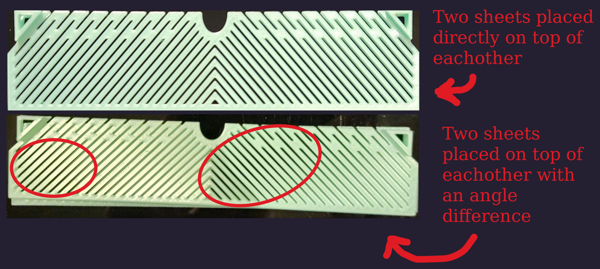
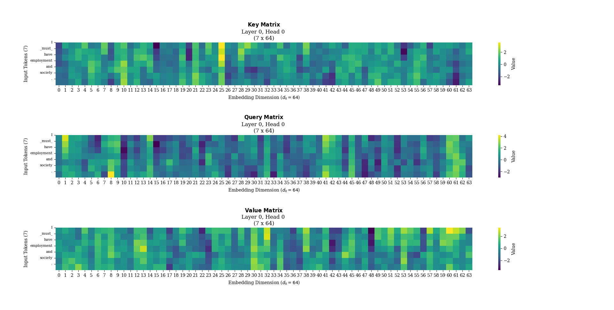

```
 ████████╗██████╗  █████╗ ███╗   ██╗███████╗██╗      █████╗ ████████╗ ██████╗ ██████╗
  ╚═██╔═╝ ██╔══██╗██╔══██╗████╗  ██║██╔════╝██║     ██╔══██╗╚══██╔══╝██╔═══██╗██╔══██╗                     
    ██║   ██████╔╝███████║██╔██╗ ██║███████╗██║     ███████║   ██║   ██║   ██║██████╔╝                     
    ██║   ██╔══██╗██╔══██║██║╚██╗██║╚════██║██║     ██╔══██║   ██║   ██║   ██║██╔══██╗                     
    ██║   ██║  ██║██║  ██║██║ ╚████║███████║███████╗██║  ██║   ██║   ╚██████╔╝██║  ██║                     
    ╚═╝   ╚═╝  ╚═╝╚═╝  ╚═╝╚═╝  ╚═══╝╚══════╝╚══════╝╚═╝  ╚═╝   ╚═╝    ╚═════╝ ╚═╝  ╚═╝                     
```

# NEWS
## I am working on a new video for my OpenML channel (March 28, 2026)
After spending about a semester studying AI after my lectures, I now have the understanding and visual tools necessary for demystifying the mathematics behind Google's attention mechanism in the transformer model.

### A peek into what I have learned
The challenge of designing AI models is the predictability of their outcome. The sheer amount of data that we feed into a neural network model is beyond our comprehension. A neural network is much less efficient at learning than we humans are. For a translator model, for example, it can take up to [**trillions** of tokens](https://huggingface.co/deepseek-ai/DeepSeek-V3#:~:text=We%20pre%2Dtrain%20DeepSeek%2DV3,to%20fully%20harness%20its%20capabilities.) and sentences to train an accurate translation model such as Google's translator model. This is many orders of magnitude more words than we humans speak throughout our entire lives, and yet we can learn multiple languages with orders of magnitude less data. Managing this much training data and designing an AI model whose learning outcome emerges as an expected result is very difficult. Making the neural network is the easy part of designing AI models. Designing a machine that produces predictable outcomes, however, is much more complex.

The main method that Google's Transformer model uses to tackle this challenge is its attention mechanism. This mechanism is present at every step of the model's functions, and it operates on a mathematical model that guides the neural network to achieve an expected learning outcome. The mathematics of this mechanism is what I am aiming to explain and visualize in my upcoming video, where once more I have managed to find a 3D model design that can aid in its visualization!

### Visualizing the matrix multiplication
The attention mechanism relies on matrix multiplications, which are essentially batches of dot products (Figure 1). In a geometric sense, the dot product acts as a similarity metric that measures the alignment between two vectors.


Specifically, a higher dot product indicates that two vectors are pointing in a similar direction in the embedding space, signaling to the model that these tokens are contextually related. It is simple to visualize using 3D models — two vectors to signify the effects of the dot product. It is much more difficult to create an analogous visualization that directly illustrates the effects of matrix multiplications on activation patterns, and that was what I had aimed to do.

After months of thinking, I stumbled upon my answer while designing and 3D printing a gift for my mom. Part of the design included two patterned sheets for aesthetics. When I was printing the batch, I took the sheets and began playing around, sliding them on top of each other. This is when I realized that a patterned sheet is perfect for visualizing the matrix dot products. If we have two matrices constructed from an input sentence whose dot products reflect their similarity, and if there are regions of high similarity in the dot product, when the result reaches the neural network of the model it will create activations in those specific areas/dimensions of similarity, which help the model find the contextual meaning of the sentence it is given.
I realized I could achieve a visualization of this concept by laying two patterned sheets on top of each other (Figure 2). If the sheets have the exact same pattern — achieved here by placing them directly on top of each other — we can see the background, which is the surface where the sheets are placed. This resembles high activation across all areas when calculating the product of two identical matrices.
If the sheets have slightly different patterns, which is achieved in my image by placing the two sheets on top of each other at different angles, there are some areas (which I circled) of high activation.


What I can do is calculate and print some of the matrices created by my Transformer model (Figure 3), assign each number of the matrix a slightly different pattern, and lay the resulting patterned sheets on top of each other, achieving a relatively accurate presentation of the matrix multiplication and its activation in the model.



# Transformer from Scratch

An implementation of the Transformer architecture from the paper ["Attention Is All You Need"](https://arxiv.org/abs/1706.03762) for English-to-French translation.
This is a project of mine that I am using to learn about AI and AI development.
My goal for this project is to get it efficient enough to rent Google Colab computers and train the model through Google Colab.

I will be documenting my learning by creating and posting high-quality videos on a [YouTube channel](https://www.youtube.com/@OpenML-x2d).

## AI Use
### AI use for writing code
Since the scope of my project is to learn about AI and the transformer model, I will develop code related to the model myself.
However, work outside the scope of this project, such as app development, is done through AI vibe-coding since I have no time or resources to spend on app development myself, and I have no team of developers (but am looking forward to having one).
I will be 100% transparent about my use of AI in my commit messages.

### AI use for writing documentation
I will sometimes use AI for creating documentation files. This is because, as a student single-handedly working on this project, I do not have enough time to dedicate to creating high-quality and well-structured documentation files. However, I will make sure to read through and make changes if needed. All these files are reviewed by me, as I will have to use them myself to catch up on the most recent developments and implementations I have made in my code. I will put warnings in the file names or inside the documentation letting you know if a file was made using AI.

## 🚀 Features

- **Full Transformer Implementation**: Encoder-decoder architecture with multi-head attention
- **Tokenizers**: Custom BPE tokenizers for English and French
- **Training Pipeline**: Complete training loop with checkpointing
- **Translation**: Interactive translation script
- **Visualization**: Attention weights and training metrics

## 📁 Project Structure

```
.
├── Transformer_from_scratch.py   # Core transformer implementation
├── train.py                      # Training script
├── translate.py                  # Translation inference
├── dataset.py                    # Data loading and preprocessing
├── config.py                     # Configuration settings
├── processes.py                  # Process time tracking
├── Training_performance_plotter  # A performance plotter for training and inference data
├── tokenizer_en.json             # English tokenizer
├── tokenizer_fr.json             # French tokenizer
├── weights/                      # Model checkpoints
├── Documentation/                # Is a folder containing Document pdfs
└── logs/                         # Training logs
```

## 🛠️ Setup

```bash
# Install dependencies
pip install torch numpy matplotlib tensorboard

# Train the model
python train.py

# Translate text
python translate.py

# To load an interactive app with training/inference data charts
python Transformer_from_scratch.py
```

## 📝 Usage

### Training

```bash
python train.py
```

The training script will:
- Load and preprocess the dataset
- Train the transformer model
- Save checkpoints to `weights/`
- Log metrics to TensorBoard

### Translation

```bash
python translate.py
```

Enter English text and get French translations!

## 📊 Results

The model achieves competitive BLEU scores on English-to-French translation tasks after training.

## 📖 References

- Vaswani et al., "Attention Is All You Need", NeurIPS 2017

- Base transformer model before modifications are based on Umar Jamil's YouTube Video on creating a transformer from scratch: https://youtu.be/ISNdQcPhsts
- Umar Jamil's GitHub:  https://github.com/hkproj
